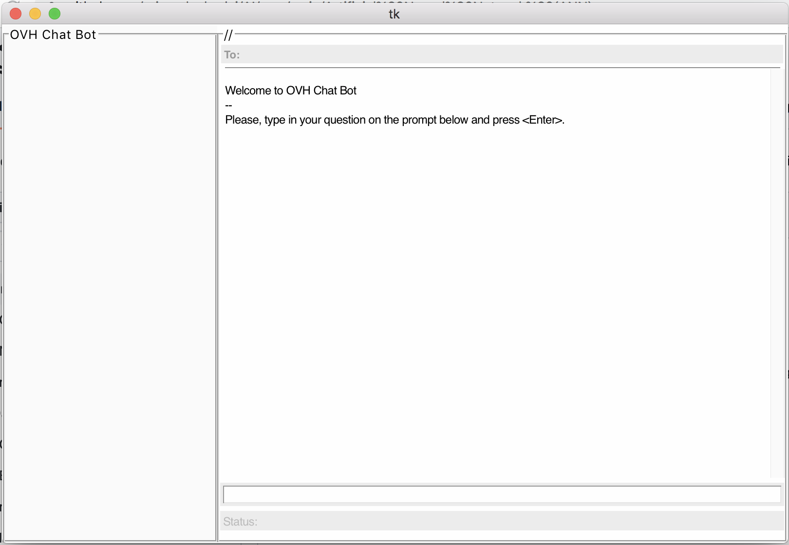

**OVH Chat Bot**
==
Graphic User Interface (GUI) for testing OVH Neural Networ (OVH-NN) models training to follow an instruction in a prompt and provide a detailed response. 

This version only utilizes two fundamental neural network models:

 (a) Convolution Neural Network (CNN) for computer vision processing and 
 (b) Recurrent Neural Network (RNN) for Natural Language Processing (NLP)

