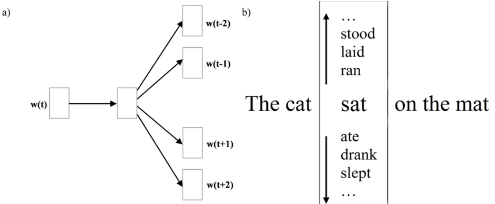
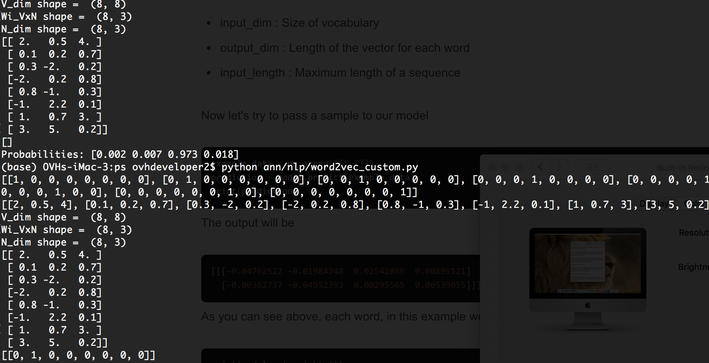
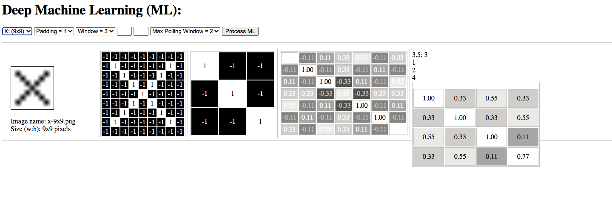

**Artificial Neural Network (ANN)**
===

Deep Machine Learning (ANN) algorithm source codes for both NLP and Image-recognision models.

Natural Langugae Processing (NLP):
--

Word2Vector Embeding using Skip-gram algorithm

Word2Vector Embeding Testing
--

Computer Vision: Confolution Neural Network
--

