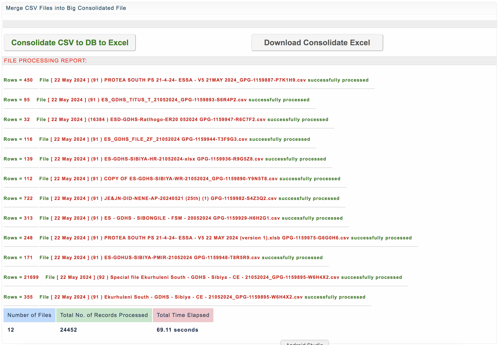

**CSV to DataBase (DB) Package**
==
CSV classes to handle primarily CSV related functions such as importing CSV to databse (DB) and other useful functions such as generating an actual Excel document dynamically and programmatically.

The packadge is available in both **PHP** and **Python** languages.

