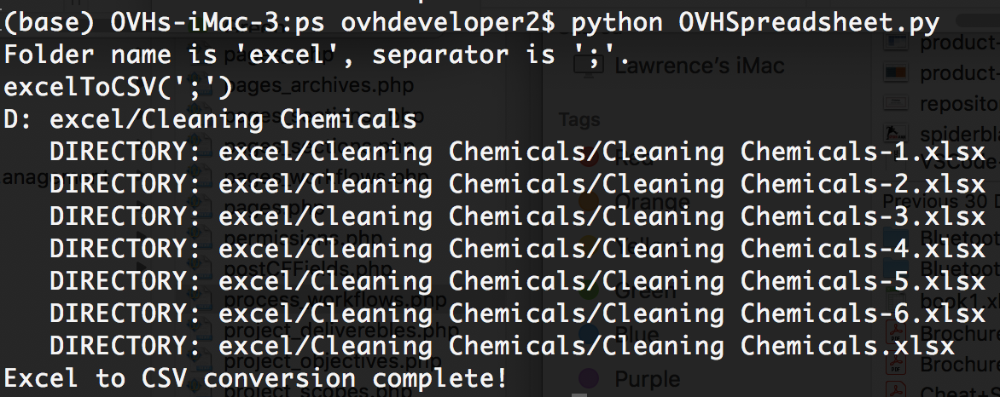

**Spreadsheet Package**
===
Spreadsheet class to handle primarily Microsoft Excel related functions such as exporting Excel to CSV exports and other useful functions such as generating an actual Excel document dynamically and programmatically. 

**Excel To CSV Export Function**
A python function that converts all the excel documents for both file extensions ".xlsm" and ".xlsx" using panda library.

How to:
--
Excel = Spreadsheet("excel",";") # Declare and initialise a Spreadsheet class to look for MS Excel documents inside a folder named "excel" and separate the CSV files using "|" as a delimeter
print(str(Excel))
print(repr(Excel))
Excel.convert_excel_to_csv() # Convert Excel files to CSV

Output
--

