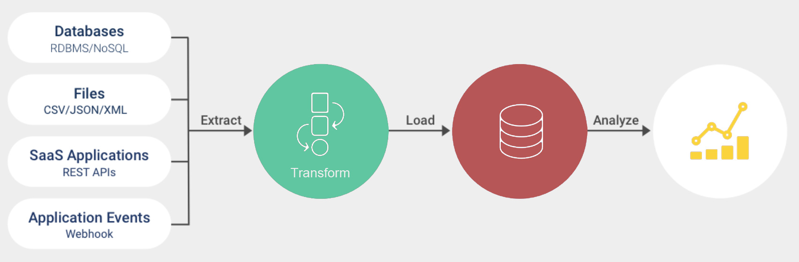
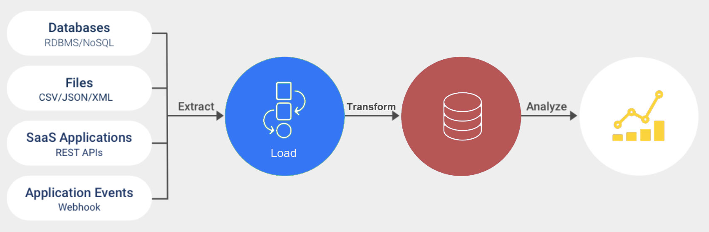

**Machine Learning and Deep Machine Learning (ANN)**
===

Data Science and Deep Machine Learning (ANN) algorithm source codes mostly written primarily in Python.

ETL and ELT Tools
==

Scripts for processing data from multiple sources into a large, central respository called data warehouse.

